# KHUMBULA APP

This is the front-end of the **Khumbula** application, built using React, TypeScript, Tailwind CSS, Redux Toolkit for state management, axios for http requests and React-hook-form + Yup for form handling and validation.

### Note

Best experience on mobile phone

🚧 This project is a work in progress and will continue to evolve as I actively grow and apply new skills throughout my development journey.

## Description

Khumbula is a reminder web app designed to help users manage their medication schedules efficiently. Users can register, add their medications, and set alerts to be reminded when to take specific pills and in what quantity. This API allows interaction with users, pills, and alerts to facilitate medication management.

## 🌐 Live URL

> https://khumbula.site

## 🛠 Tech Stack

- React
- Redux Toolkit
- Tailwind CSS
- React-Hook-Form
- Yup
- Axios (for API requests)

## 📦 Getting Started

### 1. Clone the Repository

```bash
git clone https://github.com/Mpilo-dev/khumbula_frontend.git
cd khumbula_frontend
```

### 2. Install Dependencies

```bash
npm install
```

###3. Start the Development Server

```bash
npm start

This will run the app locally at http://localhost:8000.

```

## 🚀 Features

- User registration and authentication
- Profile update functionality
- Password reset & forgot password flows
- Create, read, update, and delete (CRUD) medications (pills)
- Create and manage medication alerts
- Form handling with validation (React Hook Form + Yup)
- State management using Redux Toolkit

## 📷 Screenshots

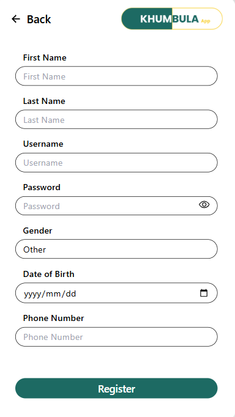
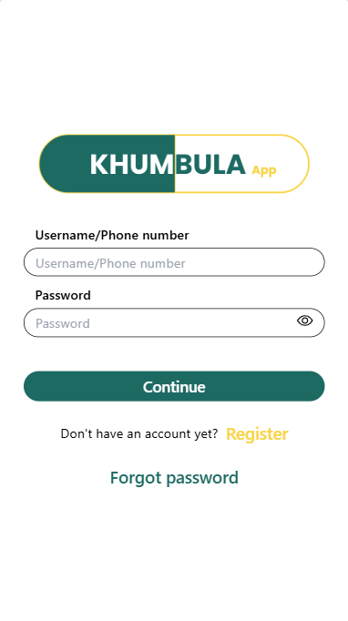
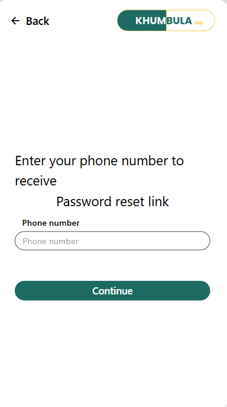
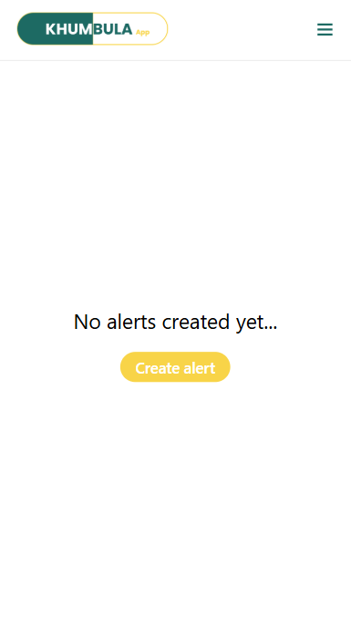
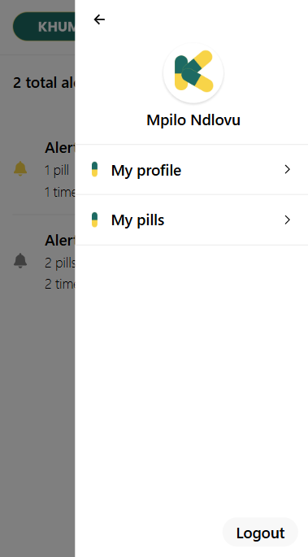
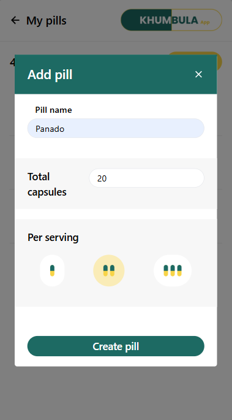
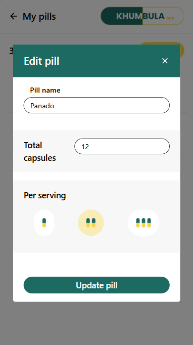
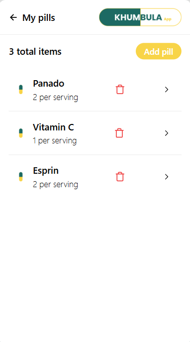
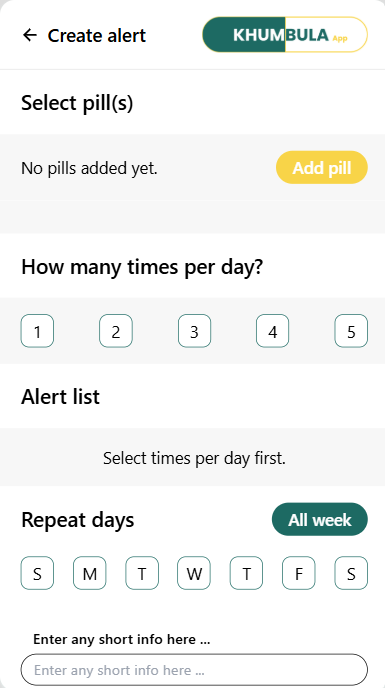
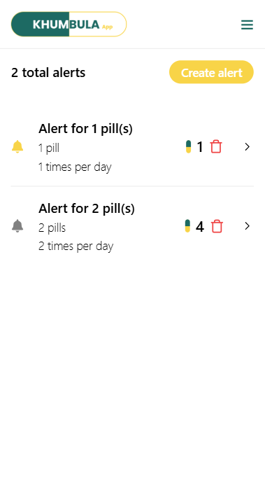
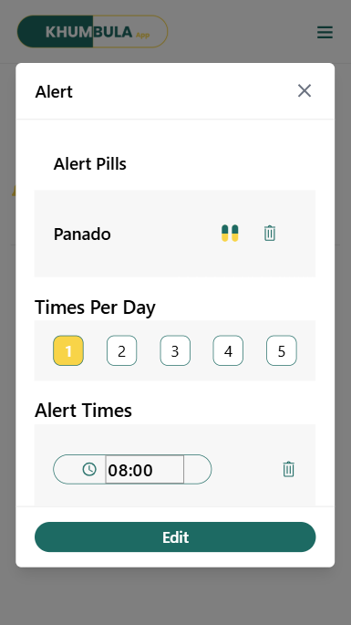

## ✨ Future Enhancements

- The project will be updated as it's still a work in progress
